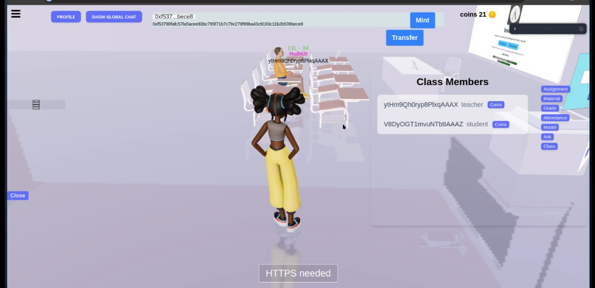

# Meta-Edu-Aptos

## Introduction

Welcome to **Meta-Edu-Aptos**, a 3D Metaverse platform designed to enhance education through immersive virtual environments. The platform allows students to interact with course materials, complete assignments, and participate in quests—all within a dynamic and engaging virtual space. Using **Aptos blockchain technology** and the **Move programming language**, Meta-Edu-Aptos rewards students with tokens and allows them to mint NFTs based on their academic achievements, creating a gamified learning experience.

Our mission is to break down geographical barriers and provide an accessible, interactive, and global learning environment.

---

## Key Features

- **3D Virtual Classroom**: Simulate realistic classroom settings with interactive lessons, 3D models, and real-time collaboration.
- **Task-Based Rewards**: Earn Aptos-based tokens by completing educational quests and assignments.
- **NFT Minting**: Mint NFTs based on academic milestones.
- **Token Rewards System**: Spend tokens earned in the virtual shop on educational tools or fun items.
- **Multilingual Support**: Access educational content in your preferred language.
- **Enhanced Learning Materials**: Teachers can upload PDFs, 3D models, and multimedia to create rich learning resources.
- **Real-time Collaboration**: Engage in real-time video and audio conferences powered by WebRTC and Socket.io.

---

## Tech Stack

Meta-Edu-Aptos is built using a diverse range of technologies:

- **Three.js** for 3D rendering.
- **React** for dynamic UIs.
- **Langchain** for real-time conversational AI.
- **Python** for backend services.
- **GSAP** for animations.
- **R3F** for integrating 3D elements in React.
- **Move** for writing smart contracts on the Aptos blockchain.
- **Aptos** for secure blockchain transactions.
- **Petra Wallet** for managing Aptos-based token transactions.
- **Socket.io** and **WebRTC** for real-time communication.
- **MongoDB** for database management.
- **WebXR** for AR/VR experiences.
- **pyttsx3** for text-to-speech interactions.

---

## Images

## How to Run the Project

### Prerequisites

Ensure that the following are installed:

- **Node.js**: Required to run server-side JavaScript.
- **Python 3.x**: For backend services.
- **MongoDB**: Database for managing user data and course materials.
- **Aptos CLI**: To deploy smart contracts.
- **Petra Wallet**: To handle transactions on the Aptos network.

### Running the Project Locally

1. **Clone the Repository**:
   bash
   git clone https://github.com/yourusername/meta-edu-aptos.git
   cd meta-edu-aptos

2. **Run Backend Services**:

   - **Start the Socket.io server**:
     bash
     node socket-server.js

   - **Start the Langchain service**:
     bash
     python app.py

   - **Start the main backend server**:
     bash
     nodemon index.js

3. **Run AR Server** (Note: AR functionality depends on PC compatibility):
   bash
   npx vite --host

4. **Run the Frontend**:
   bash
   npm run dev

## Blockchain Functionalities

- Deploy smart contracts using Aptos CLI.
- Connect Petra Wallet to manage blockchain transactions.

### Contract Information

All token and NFT functionalities are deployed on the Aptos testnet. You can access the contract via the following address:

- **Petra Wallet Address:** `0x2a2f75fadf5ab3bbbe9baffc87f0f6be11aece54350ac85abb68ade94404dc89`

## Contribution Guidelines

We welcome contributions from developers, designers, and educators. Follow these steps to contribute:

1. **Fork the Repository:** Make a personal copy of the repository.
2. **Create a Branch:** Develop your feature or fix on a separate branch.
3. **Submit a Pull Request:** Once your feature is ready, submit a pull request for review.

For more details, refer to the `CONTRIBUTING.md` file.

## License

Meta-Edu-Aptos is licensed under the MIT License. For more details, see the `LICENSE` file.
